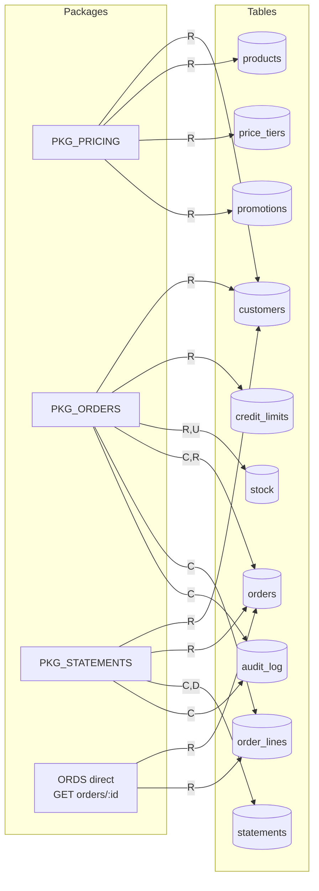
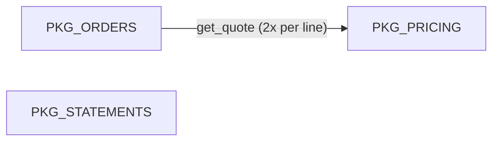
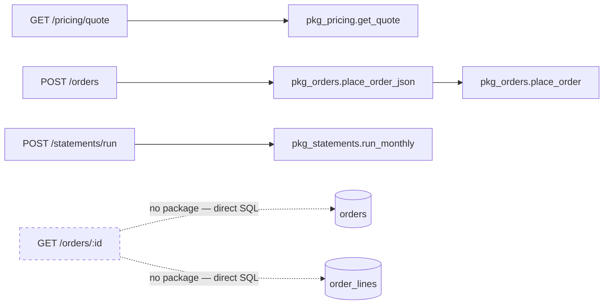

# Dependency map — legacy wholesale schema

Derived strictly from `legacy/db/init/01_schema.sql` … `05_seed.sql` and
`legacy/ords/modules.sql`. Every edge below is backed by a line citation in the
[Edge references](#edge-references) section. Seed data (`05_seed.sql`) writes to
most tables but is one-shot bootstrap, not a runtime module, so it is excluded
from the matrices.

## 1. Package-to-table CRUD matrix

Rows are the three packages plus `ORDS direct` — a pseudo-module for the one
ORDS handler that reads tables without going through any package
(`GET orders/:id`).

| Module | customers | credit_limits | products | stock | price_tiers | promotions | orders | order_lines | statements | audit_log |
|---|---|---|---|---|---|---|---|---|---|---|
| PKG_PRICING    | R | – | R | –   | R | R | –  | – | –   | – |
| PKG_ORDERS     | R | R | – | R,U | – | – | C,R | C | –   | C |
| PKG_STATEMENTS | R | – | – | –   | – | – | R  | – | C,D | C |
| ORDS direct (`GET orders/:id`) | – | – | – | – | – | – | R | R | – | – |

Sequence usage (not tables, noted for completeness): PKG_ORDERS uses
`seq_orders` [E16] and `seq_audit` [E17]; PKG_STATEMENTS uses `seq_statements`
[E18] and `seq_audit` [E14].

## 2. Package-to-package calls

Exactly one inter-package edge exists in the codebase: `PKG_ORDERS` calls
`pkg_pricing.get_quote` — twice per order line (once in the pre-pricing/credit
loop, once again when inserting each line) [E19, E20]. The comment at
`03_pkg_orders.sql:73` ("quote logic is THE single source, RT-2203") makes the
dependency intentional: order totals are definitionally whatever pricing says.

`PKG_STATEMENTS` calls no other package, and nothing calls it.
`PKG_PRICING` calls no other package.

**Migration-ordering implication:** PKG_PRICING is the only shared dependency
and is itself a leaf (calls nothing). Any reimplementation of order placement
must reproduce pricing byte-for-byte first — including the `TRUNC(l_price, 2)`
rounding at `02_pkg_pricing.sql:103` — or order totals will drift from the
legacy side during coexistence. Pricing therefore migrates before (or at latest
together with) orders; it can never migrate after.

## 3. Endpoint-to-package routing

Four endpoints in ORDS module `legacy.api`. Three delegate to a single package
procedure; one — `GET /orders/:id` — bypasses the package layer entirely and
queries `orders` + `order_lines` with plain SQL inside the handler.

**The asymmetry that matters for the wave plan:** `GET /orders/:id` is the only
endpoint whose behavior is *not* encapsulated in PL/SQL packages — its entire
contract is a `JSON_OBJECT`/`JSON_ARRAYAGG` projection over two tables [E23,
E24]. Strangling it requires only read access to those tables and JSON-shape
parity, with no business logic to port. Conversely, the three package-backed
endpoints carry their package's full transactional semantics (pricing quirks,
credit check, stock reservation, rerun-safe delete) across with them.

## Edge references

All line numbers refer to files under `legacy/`.

**PKG_PRICING → tables** (`db/init/02_pkg_pricing.sql`)
- [E1] R customers — `SELECT cust_class INTO l_class FROM customers …` lines 56–59
- [E2] R products — `SELECT list_price INTO x_list_price FROM products …` lines 61–64
- [E3] R price_tiers — cursor `c_tier` lines 45–50, fetched lines 68–70
- [E4] R promotions — `SELECT promo_id, promo_price, promo_disc_pct … FROM promotions …` lines 81–86

**PKG_ORDERS → tables** (`db/init/03_pkg_orders.sql`)
- [E5] R credit_limits, R customers — `SELECT cl.credit_limit … FROM credit_limits cl, customers c …` lines 67–71
- [E6] R orders — outstanding-exposure sum `SELECT NVL(SUM(total_amt),0) … FROM orders …` lines 83–86
- [E7] C orders — `INSERT INTO orders …` lines 95–96
- [E8] R stock — `SELECT qty_on_hand, qty_reserved … FROM stock … FOR UPDATE` lines 104–108
- [E9] U stock — `UPDATE stock SET qty_reserved = …` lines 115–118
- [E10] C order_lines — `INSERT INTO order_lines …` lines 125–126
- [E11] C audit_log — `INSERT INTO audit_log …` in `log_audit`, lines 43–44 (invoked line 129)

**PKG_STATEMENTS → tables** (`db/init/04_pkg_statements.sql`)
- [E12] R customers — cursor `c_cust` lines 24–28
- [E13] R orders — `SELECT NVL(SUM(DECODE(status, …))) … FROM orders …` lines 52–60
- [E14] C audit_log — `INSERT INTO audit_log …` lines 75–77
- [E15] D statements — `DELETE FROM statements WHERE period = p_period` line 47; C statements — `INSERT INTO statements …` lines 65–70

**Sequences**
- [E16] seq_orders — `x_order_id := seq_orders.NEXTVAL` `03_pkg_orders.sql:93`
- [E17] seq_audit — `seq_audit.NEXTVAL` `03_pkg_orders.sql:44`
- [E18] seq_statements — `seq_statements.NEXTVAL` `04_pkg_statements.sql:69`; seq_audit `04_pkg_statements.sql:76`

**Package → package**
- [E19] PKG_ORDERS → pkg_pricing.get_quote (pricing loop) — `03_pkg_orders.sql:76–78`
- [E20] PKG_ORDERS → pkg_pricing.get_quote (line-insert loop) — `03_pkg_orders.sql:121–123`

**Endpoint → package / table** (`ords/modules.sql`)
- [E21] GET `pricing/quote` → `pkg_pricing.get_quote` — line 49
- [E22] POST `orders` → `pkg_orders.place_order_json` — line 86 (which delegates to `place_order`, `03_pkg_orders.sql:160`)
- [E23] GET `orders/:id` → direct R on orders — `FROM orders o WHERE o.order_id = TO_NUMBER(:id)` lines 137–138
- [E24] GET `orders/:id` → direct R on order_lines — correlated subquery `FROM order_lines l WHERE l.order_id = o.order_id` lines 132–133
- [E25] POST `statements/run` → `pkg_statements.run_monthly` — line 161

## What this means for sequencing

On pure dependency grounds, **PKG_PRICING migrates first**. It is a leaf: it
calls no other package, performs only reads (4 tables, zero writes, zero
sequence use), and is the sole target of the codebase's single inter-package
edge. Migrating it first unblocks the hardest consumer (PKG_ORDERS, which
invokes `get_quote` twice per order line as its pricing source of truth) while
risking no data mutation — a wrong answer during parity testing corrupts
nothing. The read-only `GET /orders/:id` endpoint is a close second candidate:
it touches no package at all, so it can be strangled independently in any wave
with only table-read parity. PKG_STATEMENTS has no package dependencies either,
but it writes (`DELETE`/`INSERT` on statements, audit inserts), making it a
riskier "first" than pricing. PKG_ORDERS must go last among the packages: it
depends on pricing behavior and owns the only multi-table read-write
transaction (orders, order_lines, stock, audit_log in one commit).

## Architect review

> Status: **pending sign-off** — this footer was drafted in the build session;
> the architect's merge of the M0 PR constitutes the human decision (ADR-0004).

- **Verified:** all 25 edges spot-checked against source during review; CRUD
  matrix and the single package-to-package edge confirmed accurate.
- **Decision to ratify — seed exclusion:** agent excluded `05_seed.sql`
  bootstrap writes from the runtime matrix. Endorsed: seed is provisioning,
  not runtime behavior.
- **Architect addition:** the double `get_quote` call per order line is not
  just intentional coupling — it is a latent consistency hazard. Both calls
  must see the same promotion state; a promotion window boundary crossing
  mid-transaction could price the credit check and the stored line
  differently. Carried into the classification risk register and the parity
  corpus requirements (pricing + order placement tested as a pair).
